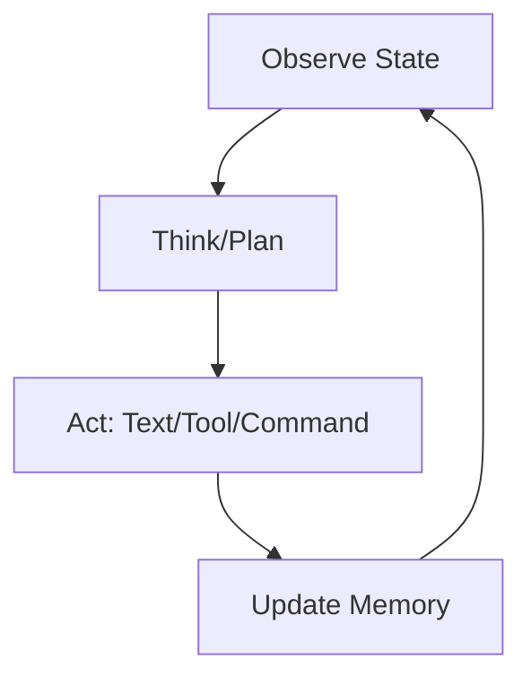
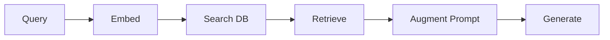
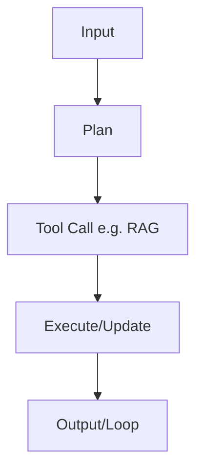
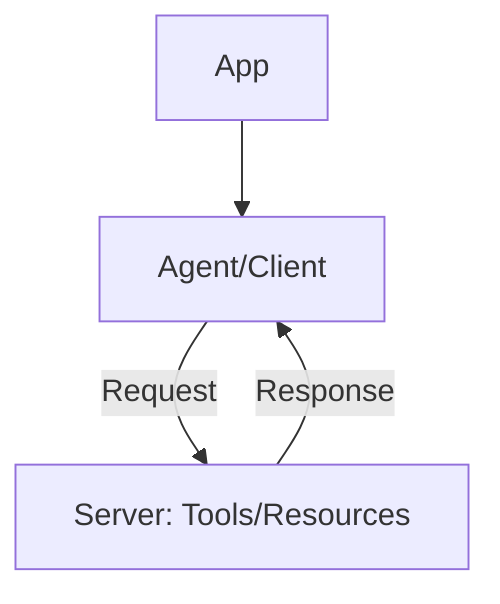

# Fundamentals of Agent Engineering

Hey, asipring AI tinkerer! This repo shares core insights from Break Into Data's Agent Engineering Bootcamp lectures. It's a free resource to kickstart your journey into building production-grade agents. Dive in for the essentials in conversational, high-level format. For full hands-on experience, explore the bootcamp at [maven.com/agent-lab/agent-engineering-bootcamp](https://maven.com/agent-lab/agent-engineering-bootcamp). Let's build!

## Module 1: Agent Engineering 101

What is it? AI agents are smart systems that observe state (inputs, history), think strategically, and act via text, tools, or commands in loops.

Why is it important? Agents power the next wave of AI—automation in industries like startups and tech giants, boosting careers in high-demand roles.

Main challenges:
- Flexibility vs predictability in dynamic decisions.
- Cost and latency in iterative loops.
- Debugging error accumulation.
- Adapting to surprises without rigid structures.
- Resource management for scalability.

How it's built: LLM core with observe-think-act cycle; workflows for fixed paths, agents for autonomy.

## Module 2: Context Engineering (Management & RAG)

What is it? Feeding agents optimal info; RAG retrieves external data, augments prompts, generates better outputs.

Why is it important? Context is king—prevents hallucinations, enables real-world apps like enterprise search.

Main challenges:
- Imperfect initial retrievals.
- Efficient vector scaling.
- Semantic vs keyword balance.
- Testing beyond vendor claims.
- Hybrid integration complexity.

How it's built: Embed docs, store in vector DB, query for matches, inject into LLM.

## Module 3: Building Your First Agent

What is it? Basic agent with tools, context, single or multi setups (sequential/parallel).

Why is it important? Hands-on foundation; mirrors industry stacks for thinking like pros at places like LangChain.

Main challenges:
- Tool bloat in context.
- Multi-agent sync issues.
- Read vs write task optimization.
- Latency control.
- Smooth context handling.

How it's built: LLM with tools; sequential for writes, parallel for reads.

## Module 4: MCP (Model Context Protocol)

What is it? Protocol for agents to access tools/resources from servers efficiently, beyond raw APIs.

Why is it important? Streamlines integrations; vital for scalable agents in production at firms like WorkOS.

Main challenges:
- Granular API overload.
- Workflow-focused servers.
- Local/remote setup.
- Human-in-loop elicitation.
- Secure exposure.

How it's built: Clients connect to servers via streams; provide tools/RAG.

More modules (Tracing/Evals, Memory, Use Cases) coming soon. Meanwhile, use this as your go-to guide for architecting full-stack, production-grade AI apps! Happy tinkering!
