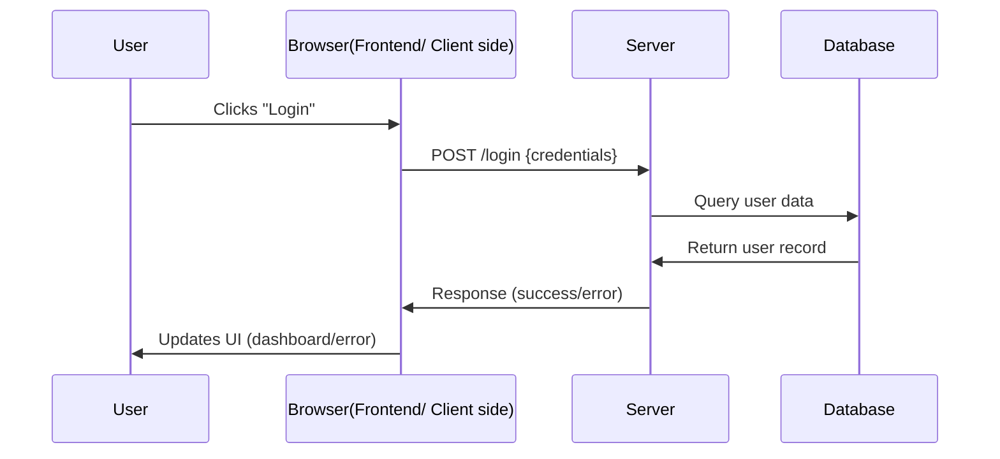
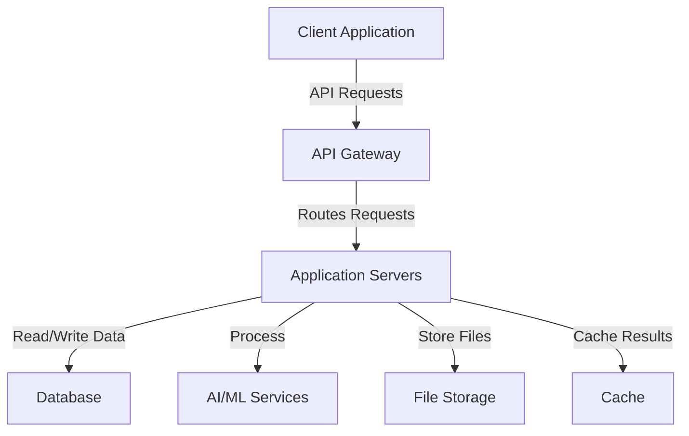
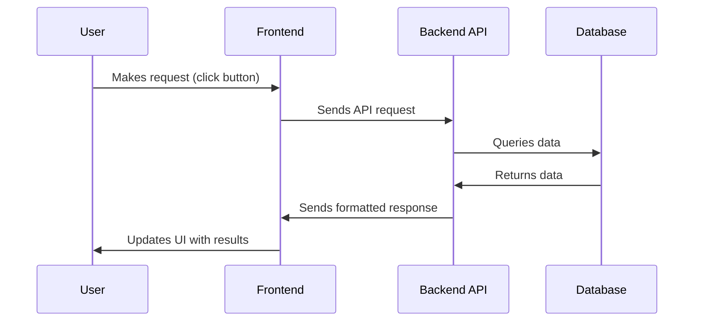
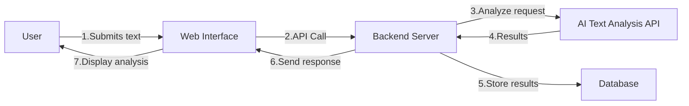

This lesson dives into how web applications actually work—from frontend interfaces to backend logic and databases. Understanding how data moves across the web is crucial for any AI engineer aiming to build tools that are more than just local scripts. 

## 🎯 Learning Objectives

By completing this module, you'll be able to:

- Understand frontend/backend architecture
- Explore system design fundamentals
- Learn TypeScript basics for AI applications
- Master API concepts and implementation

---

## 📚 Day 12: Web Application Fundamentals

### Client-Side vs. Server-Side Development

### What You'll Learn:

- The distinction between frontend and backend
- How web applications communicate
- The request-response cycle

### Frontend (Client-Side)

- What users see and interact with (UI/UX)
- Runs in the user's browser
- Technologies: HTML, CSS, JavaScript, React, Vue, Angular
- Responsible for: Rendering UI, handling user interactions, making API calls

### Backend (Server-Side)

- Invisible to users but powers the application
- Runs on remote servers
- Technologies: Node.js, Python, Java, Go, etc.
- Responsible for: Business logic, data processing, authentication, database operations

### Frontend vs Backend

| Frontend (Client) | Backend (Server) |
| --- | --- |
| What user sees (UI) | Handles logic, databases |
| HTML, CSS, JS | Python, Node.js, Django, Express |
| Runs in browser | Runs on server |

Further Reading: https://www.fullstackfoundations.com/blog/client-side-vs-server-side

*Image Resource: https://medium.com/@donotapply/client-side-vs-server-side-whats-the-difference-a933341cd60e*

### The Request-Response Cycle:

### Application Layers & Middleware

Web applications typically have several distinct layers:

### Presentation Layer

- User interfaces (websites, mobile apps)
- Handles rendering and user interaction
- Communicates with application layer via API

### Application Layer

- Core business logic and processing
- Handles requests from presentation layer
- Communicates with data layer

### Data Layer

- Database storage and retrieval
- Data persistence and management
- Structured or unstructured data storage

### Middleware

Software components that connect different application parts:

- Authentication middleware
- Logging middleware
- Error handling middleware
- API gateway

Further reading on Middleware - https://srivastavayushmaan1347.medium.com/understanding-middlewares-a-comprehensive-guide-with-practical-examples-c80383f888d5

**Different Layers of Modern Web Application Architecture**

*Image Resource:* https://www.sayonetech.com/blog/web-application-architecture/

Web Application Architecture Further Reading - https://www.sayonetech.com/blog/web-application-architecture/

### System Design Concepts

Reading - [System Design Basics](https://dev.to/kaustubhyerkade/system-design-fundamentals-a-complete-guide-for-beginners-3n95)

Key Components:

### Basic Application Data Flow:

### Example: AI-Powered Text Analysis App

### Practice Activities:

1. **System Component Identification:**
    - For a familiar app (like Instagram or Spotify), identify the frontend components, backend components, and databases.
2. **Data Flow Mapping:**
    - Map out what happens when you post a comment on a social media platform, from UI to database and back.
3. **Layer Identification Exercise:**
    - For a note-taking app, identify what belongs in each layer (presentation, application, data).

### Resources:

- [Frontend vs Backend Development](https://www.fullstackfoundations.com/blog/client-side-vs-server-side)
- [Web Application Architecture](https://www.sayonetech.com/blog/web-application-architecture/)
- [Middleware](https://srivastavayushmaan1347.medium.com/understanding-middlewares-a-comprehensive-guide-with-practical-examples-c80383f888d5)
- [System Design Basics](https://dev.to/kaustubhyerkade/system-design-fundamentals-a-complete-guide-for-beginners-3n95)

---

### 🚀 Later in the bootcamp, this is the pipeline you’ll use to capture user input, process it using LLMs, and return AI results.
